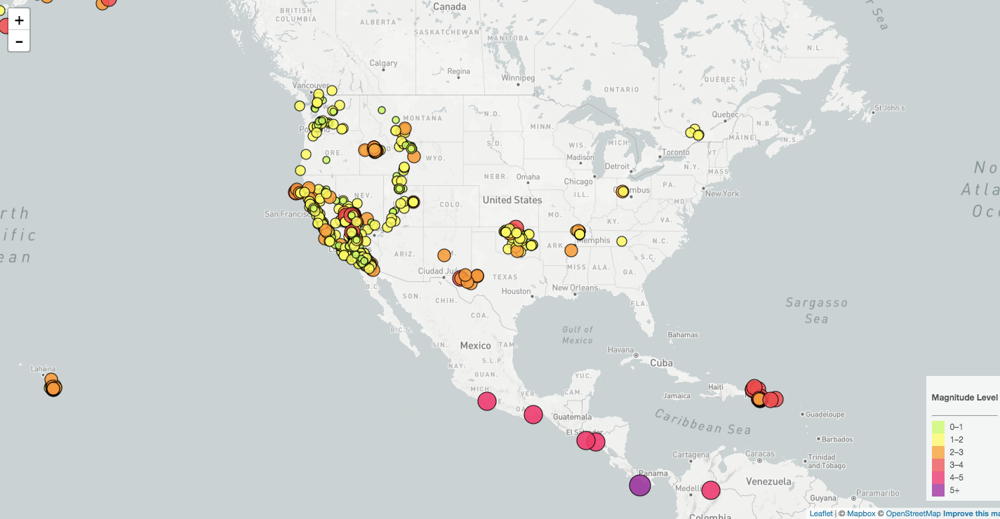
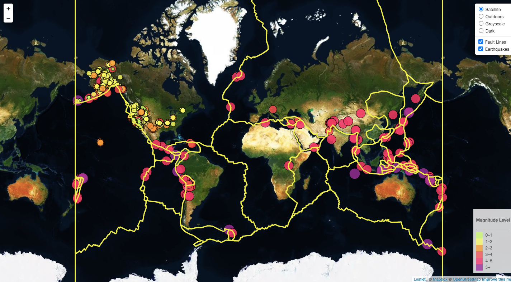

# Displaying earthquake data from USGS using Leaflet and Mapbox.

Welcome to the United States Geological Survey, or USGS for short. The USGS is responsible for providing scientific data about natural hazards, the health of our ecosystems and environment; and the impacts of climate and land-use change. Their scientists develop new methods and tools to supply timely, relevant, and useful information about the Earth and its processes. As a new hire, you will be helping them out with an exciting new project!

The USGS is interested in building a new set of tools that will allow them to visualize their earthquake data. They collect a massive amount of data from all over the world each day, but they lack a meaningful way of displaying it. Their hope is that being able to visualize their data will allow them to better educate the public and other government organizations (and hopefully secure more funding) on issues facing our planet

## Level-1: Basic Visualization

### DataSet
Earthquake data for the last 7 days is used for the visualization. The data is taken as a JSON format from the [USGS](http://earthquake.usgs.gov/earthquakes/feed/v1.0/geojson.php), which is updated every 5 minutes.

### Visualization
Creating a map using Leaflet that plots all of the earthquakes from your data set based on their longitude and latitude.

The visualzation includes
   * Data markers which reflect the magnitude of the earthquake in their size and color. Earthquakes with higher magnitudes appear larger and darker in color.

   * Popups that provide additional information about the earthquake when a marker is clicked.

   * A legend that will provide context for your map data.

The Level-1 page can be accessed [here](https://cliffordsepato.github.io/leaflet-challenge/Leaflet-Step-1/index.html)

## Level-2: Advanced Visualization

### Additional dataset
[Tectonic plates](https://github.com/fraxen/tectonicplates) were added in this map in order to illustrate the relationship between tectonic plates and seismic activity.

### Visualization

* A base map object with 4 map layers to choose from was added 
* An overlay map which contains plates layer and geoJSON layer was also added.
* Layer controls to our map was created.

The Level-2 page can be accessed [here](https://cliffordsepato.github.io/leaflet-challenge/Leaflet-Step-2/index.html)
